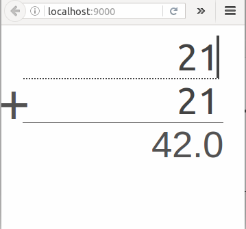
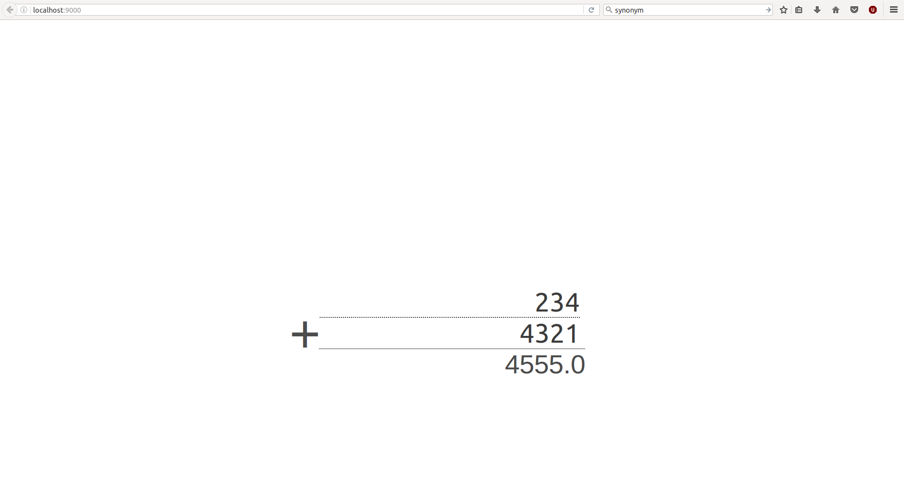

A *responsive web app* coded using vanilla JS and the play Scala framework, the app simply adds two numbers together. 

The mobile version:

The big screen version:

The web client captures any changes occurring in the input fields of the web page. When a change happens the client sends a 
XML POST request to the remote server asking for the result of the addition of those two numbers.
The XML POST request is passed those two numbers via a JSON object.

The server responds either by a 200 status code and the result or a 400 bad request with a message telling
the input is not a number.
The handler of the POST request simulates a long execution time of the addition of the two numbers using scala Futures and a Thread.sleep(2000) call.

All the assets (JS, and CSS) are in the /public folder.
The only HTML webpage is in /app/views/index.scala.html
The controller code is in /app/controllers/AdditionerController.scala
The router code is in the /conf/routes file

To use the calculator you have multiple choices:

## Use it in development mode:
In this case you will need to install sbt and java. [This is a link to the sbt website](http://www.scala-sbt.org/download.html).
This will allow you to execute scala code. Then go to the root of the project, and type *sbt run* in your terminal.

## Just execute it:
This method requires less installations, it will require you to execute either a bash or a bat script present
in the zip file contained in the root directory of this project.
Unzip the *calculetteweb-1.0.zip* zip file. Go inside the bin directory it contains. 
Execute the bash script *calculetteweb* or the bat script *calculetteweb.bat*.

After that you can go on localhost:9000 to play with the app.

